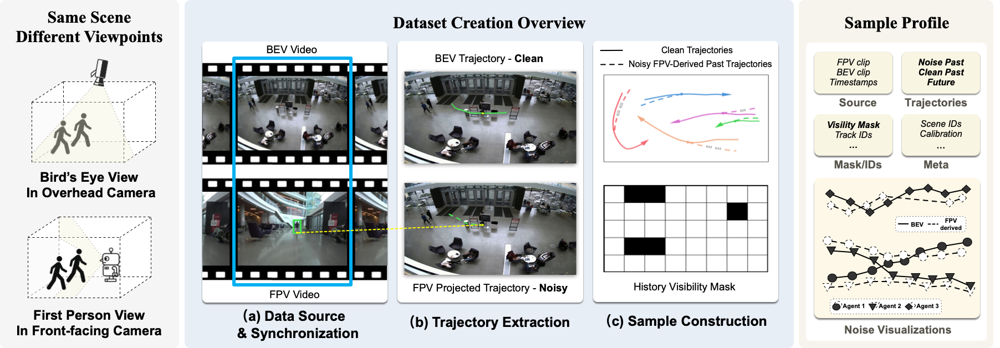
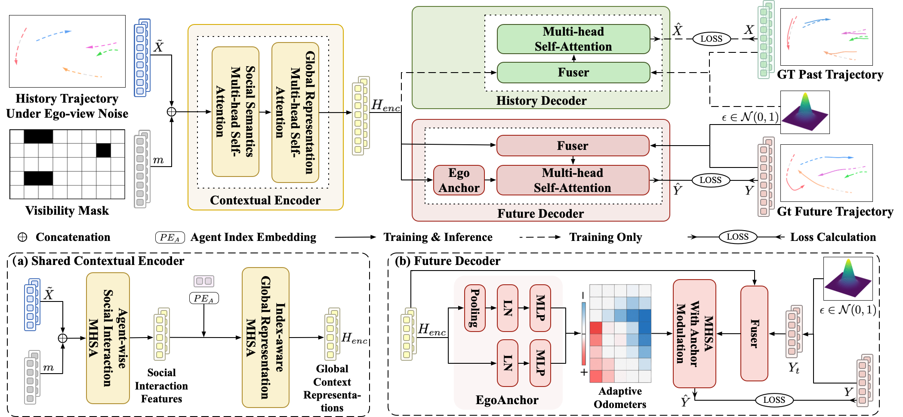

<br>
<p align="center">
<h1 align="center"><strong>EgoTraj-Bench: Towards Robust Trajectory Prediction Under Ego-view Noisy Observations</strong></h1>
  <p align="center">
    <a href='https://www.jiayi-liu.cn/' target='_blank'>Jiayi Liu</a><sup>1</sup>&emsp;
    <a href='https://jiaming-zhou.github.io/' target='_blank'>Jiaming Zhou</a><sup>1</sup>&emsp;
    <a href='https://yipko.com/about/' target='_blank'>Ke Ye</a><sup>1</sup>&emsp;
    <a href='https://kunyulin.github.io/' target='_blank'>Kun-Yu Lin</a><sup>2</sup>&emsp;
    <a href='https://allanwangliqian.com/' target='_blank'>Allan Wang</a><sup>3</sup>&emsp;
    <a href='https://junweiliang.me/' target='_blank'>Junwei Liang</a><sup>1,4</sup>&emsp;
    <br>
    <sup>1</sup>HKUST(GZ)&emsp;<sup>2</sup>HKU&emsp;<sup>3</sup>Miraikan&emsp;<sup>4</sup>HKUST
  </p>
</p>

<div id="top" align="center">

[](https://arxiv.org/abs/2510.00405)
[](https://arxiv.org/pdf/2510.00405?)
[](https://github.com/zoeyliu1999/EgoTraj-Bench)
[](https://www.youtube.com/watch?v=aVA2FuR61B8)

</div>

## 🏠 About
**EgoTraj-Bench** is a real-world benchmark for robust trajectory prediction from ego-centric noisy observations. It grounds noisy first-person visual histories in clean bird’s-eye-view future trajectories, explicitly modeling real-world perceptual artifacts such as occlusions, ID switches, and tracking drift.



**BiFlow**, our dual-stream flow matching model, jointly denoises noisy ego-centric histories and predicts future trajectories via a shared latent representation, enhanced by an EgoAnchor mechanism for robust intent modeling.




## 📝 TODO List

- [ ] Release benchmark code and repository structure.
- [ ] Release benchmark dataset and download instructions.
- [ ] Release baseline models and evaluation scripts.
- [ ] Add detailed documentation for data format, metrics, and leaderboard.
- [ ] Add examples and tutorials for using EgoTraj-Bench.

## 🙋‍♂️ Questions or Issues

If you encounter any problems or have questions about EgoTraj-Bench, please feel free to [open an issue](https://github.com/zoeyliu1999/EgoTraj-Bench/issues) on the GitHub repo.

## 🔗 Citation

If you find our work helpful, please consider starring this repo 🌟 and cite:

```bibtex
@article{liu2025egotraj,
    title   =   {EgoTraj-Bench: Towards Robust Trajectory Prediction Under Ego-view Noisy Observations},
    author  =   {Liu, Jiayi and Zhou, Jiaming and Ye, Ke and Lin, Kun-Yu and Wang, Allan and Liang, Junwei},
    journal =   {arXiv preprint arXiv:2510.00405},
    year    =   {2025}
}
```

## 📄 License

License will be updated.

## 👏 Acknowledgements

Project page template is based on [Nerfies](https://nerfies.github.io).