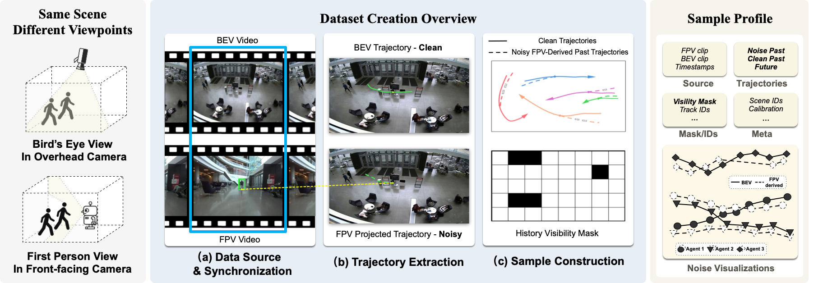
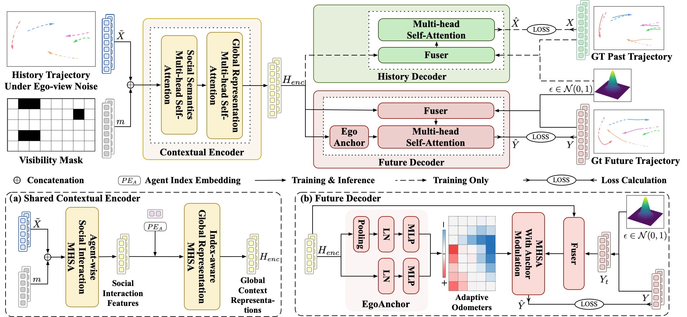

<br>
<p align="center">
<h1 align="center"><strong>EgoTraj-Bench: Towards Robust Trajectory Prediction Under Ego-view Noisy Observations</strong></h1>
  <p align="center">
    <a href='https://www.jiayi-liu.cn/' target='_blank'>Jiayi Liu</a><sup>1</sup>&emsp;
    <a href='https://jiaming-zhou.github.io/' target='_blank'>Jiaming Zhou</a><sup>1</sup>&emsp;
    <a href='https://yipko.com/about/' target='_blank'>Ke Ye</a><sup>1</sup>&emsp;
    <a href='https://kunyulin.github.io/' target='_blank'>Kun-Yu Lin</a><sup>2</sup>&emsp;
    <a href='https://allanwangliqian.com/' target='_blank'>Allan Wang</a><sup>3</sup>&emsp;
    <a href='https://junweiliang.me/' target='_blank'>Junwei Liang</a><sup>1,4</sup>&emsp;
    <br>
    <sup>1</sup>HKUST(GZ)&emsp;<sup>2</sup>HKU&emsp;<sup>3</sup>Miraikan&emsp;<sup>4</sup>HKUST
  </p>
</p>

<div id="top" align="center">

[](https://arxiv.org/abs/2510.00405)
[](https://arxiv.org/pdf/2510.00405?)
[](https://github.com/zoeyliu1999/EgoTraj-Bench)
[](https://huggingface.co/datasets/ZoeyLIU1999/EgoTraj-Bench)
[](https://www.youtube.com/watch?v=aVA2FuR61B8)

</div>


\* <span style="color:cyan">**Cyan**</span> highlights occlusion-induced gaps; <span style="color:red">**red**</span> indicates ID switches; <span style="color:limegreen">**green**</span> shows ego-centric perspective distortions.

\* **Dashed**: First person view derived; **Solid**: bird's eye view derived.

## Table of Contents

- [About](#-about)
- [News](#-news)
- [Project Structure](#-project-structure)
- [Dataset](#-dataset)
- [Model](#-model)
- [Quick Start](#-quick-start)
  - [Installation](#installation)
  - [Data Preparation](#data-preparation)
  - [Training](#training)
  - [Evaluation](#evaluation)
- [Pretrained Checkpoints](#-pretrained-checkpoints)
- [TODO List](#-todo-list)
- [Citation](#-citation)
- [License](#-license)
- [Acknowledgements](#-acknowledgements)

---

## 🏠 About

**EgoTraj-Bench** is a real-world benchmark for robust trajectory prediction from ego-centric noisy observations. It grounds noisy first-person visual histories in clean bird's-eye-view future trajectories, explicitly modeling real-world perceptual artifacts such as occlusions, ID switches, and tracking drift.





## 🚀 News

- **[2025-04]** Benchmark dataset released on [HuggingFace](https://huggingface.co/datasets/ZoeyLIU1999/EgoTraj-Bench).
- **[2025-04]** Code for BiFlow model released.

---

## 📂 Project Structure

```
EgoTraj-Bench/
├── cfg/
│   ├── biflow_k20.yml
│   ├── biflow_k5.yml
│   └── biflow_t2fpv_k20.yml
├── data/
│   ├── _download_data.py
│   ├── egotraj/
│   └── t2fpv/
├── checkpoints/               # downloaded release checkpoints (not tracked by git)
│   └── <release_name>/
│       ├── config_updated.yml
│       └── models/
│           └── checkpoint_best.pt
├── loaders/
│   └── dataloader_egotraj.py
├── models/
│   ├── backbone_biflow.py
│   ├── flow_matching_biflow.py
│   ├── context_encoder/
│   │   └── tbd_encoder_score.py
│   ├── feature_fuser/
│   │   └── shared_fuser.py
│   ├── motion_decoder/
│   │   └── mtr_decoder_score.py
│   └── utils/
│       ├── common_layers.py
│       ├── contextual_scorer.py
│       └── polyline_encoder.py
├── trainer/
│   └── biflow_trainer.py
├── scripts/
│   ├── train_biflow.py
│   ├── eval_biflow.py
│   ├── run_train.sh
│   ├── run_eval.sh
│   └── run_eval_all.sh
├── utils/
│   ├── common.py
│   ├── config.py
│   ├── dataset_config.py
│   ├── normalization.py
│   └── utils.py
├── examples/
│   ├── README.md
│   ├── test_model.py
│   └── test_pipeline.py
├── requirements.txt
└── results/
    └── <cfg_name>/               # e.g., biflow_k20 or biflow_t2fpv_k20
        └── <run_name>/
            ├── config_updated.yml
            ├── models/           # checkpoints saved here
            ├── log/
            └── samples/
```

---


## 📦 Dataset

The EgoTraj-Bench dataset is available on HuggingFace:

**🤗 [ZoeyLIU1999/EgoTraj-Bench](https://huggingface.co/datasets/ZoeyLIU1999/EgoTraj-Bench)**

| Level | Folder | Description | Size |
|-------|--------|-------------|------|
| **L2** | `L2-processed/` | Ready-to-use `.npz` files for training and evaluation | ~44 MB |
| **L1** | `L1-intermediate/` | Frame-level FPV detections + BEV GT CSVs + matching results | Coming soon |
| **L0** | `L0-raw/` | Link to [TBD raw dataset](https://kilthub.cmu.edu/authors/TBDLab_Admin/18437643) | ~170 GB |

### Data Format

Each `.npz` file contains 4 arrays:

| Key | Shape | Description |
|-----|-------|-------------|
| `all_obs` | `[N, 8, 7]` | Noisy FPV-derived past trajectories |
| `all_pred` | `[N, 20, 7]` | Clean BEV ground truth (8 past + 12 future) |
| `num_peds` | `[S]` | Number of agents in each scene |
| `seq_start_end` | `[S, 2]` | Scene boundaries in agent dimension |

7 features = `[x, y, orientation, img_x, img_y, valid_mask, agent_id]`

### Quick Example

```python
import numpy as np

data = np.load("L2-processed/EgoTraj-TBD/egotraj_tbd_test.npz")
noisy_history = data["all_obs"][:, :, :2]      # [N, 8, 2] FPV noisy xy
clean_past    = data["all_pred"][:, :8, :2]     # [N, 8, 2] BEV clean past xy
clean_future  = data["all_pred"][:, 8:, :2]     # [N, 12, 2] BEV clean future xy
valid_mask    = data["all_obs"][:, :, 5]         # [N, 8] visibility mask
```

---


## 🤖 Model

**BiFlow**, our dual-stream flow matching model, jointly denoises noisy ego-centric histories and predicts future trajectories via a shared latent representation, enhanced by an EgoAnchor mechanism for robust intent modeling.

<p align="center">
  
</p>

---


## 🛠️ Quick Start

### Installation

**Official reproducibility environment**: Python 3.9, CUDA

```bash
conda create -n biflow39 python=3.9 -y
conda activate biflow39
pip install -r requirements.txt
```

### Data Preparation

Download and organize the processed dataset (HuggingFace source) with:

```bash
python data/_download_data.py
```

Optional (custom paths):

```bash
python data/_download_data.py --data-dir ./data
```

### Training

Use the provided shell scripts for convenient training:

```bash
# EgoTraj-TBD
bash scripts/run_train.sh --fold_name tbd --gpu 0

# T2FPV-ETH (leave-one-out cross-validation, e.g., eth fold)
bash scripts/run_train.sh --fold_name eth --gpu 0
```

The script automatically selects the config, data source, and data directory based on `--fold_name`. You can also call the training script directly for more control:

```bash
python scripts/train_biflow.py \
    --cfg cfg/biflow_t2fpv_k20.yml \
    --fold_name eth \
    --data_source original_bal \
    --data_dir ./data/t2fpv \
    --epochs 150 \
    --gpu 0
```

**Available fold names:**
| Fold | Config | Data Source | Description |
|------|--------|-------------|-------------|
| `tbd` | `biflow_k20.yml` | `original` | EgoTraj-TBD (real-world ego-centric) |
| `eth` | `biflow_t2fpv_k20.yml` | `original_bal` | T2FPV-ETH (leave-one-out, test on ETH) |
| `hotel` | `biflow_t2fpv_k20.yml` | `original_bal` | T2FPV-ETH (leave-one-out, test on Hotel) |
| `univ` | `biflow_t2fpv_k20.yml` | `original_bal` | T2FPV-ETH (leave-one-out, test on Univ) |
| `zara1` | `biflow_t2fpv_k20.yml` | `original_bal` | T2FPV-ETH (leave-one-out, test on Zara1) |
| `zara2` | `biflow_t2fpv_k20.yml` | `original_bal` | T2FPV-ETH (leave-one-out, test on Zara2) |

Checkpoints and logs are saved to `results/<experiment_tag>/`.

### Quick Bash Workflow (Train + Eval)

```bash
# 1) Train (example: TBD, output goes to results/)
bash scripts/run_train.sh --fold_name tbd --gpu 0

# 2) Evaluate training output (--run_name -> results/<cfg_name>/<run_name>)
bash scripts/run_eval.sh --fold_name tbd --run_name <run_name> --gpu 0
```

### Evaluation

Two evaluation entry points are supported:

```bash
# A) Training outputs (results/)
# Single fold — use --run_name (auto-resolves to results/<cfg_name>/<run_name>)
bash scripts/run_eval.sh --fold_name tbd  --run_name <run_name> --gpu 0
bash scripts/run_eval.sh --fold_name eth  --run_name <run_name> --gpu 0

# Or pass an explicit path with --ckpt_dir
bash scripts/run_eval.sh --ckpt_dir results/biflow_k20/<run_name> --fold_name tbd --gpu 0

# All T2FPV-ETH folds at once (results mode)
bash scripts/run_eval_all.sh --source results --ckpt_base results/biflow_t2fpv_k20 --gpu 0
```

```bash
# B) Release checkpoints (checkpoints/T2FPV-*)
# Single fold
bash scripts/run_eval.sh --fold_name eth --release_name T2FPV-eth --gpu 0

# All T2FPV-ETH folds at once (release mode, default)
bash scripts/run_eval_all.sh --source release --gpu 0
```

For `run_eval_all.sh` in `results` mode, each fold is read from `<ckpt_base>/<fold>/` (or `<ckpt_base>/<fold>/ckpt/` for compatibility).
In `release` mode, it reads from `checkpoints/T2FPV-<fold>/`.

**Metrics reported**: ADE/FDE (min-of-K, K=1,3,5,20), JADE/JFDE (joint metrics).

---


## 📥 Pretrained Checkpoints

Checkpoints are hosted on HuggingFace under
[ZoeyLIU1999/EgoTraj-Bench](https://huggingface.co/datasets/ZoeyLIU1999/EgoTraj-Bench/tree/main/models).

| Model | Dataset | Fold | Release Name | ADE (K=20) | FDE (K=20) | Checkpoint |
|-------|---------|------|-------------|------------|------------|------------|
| BiFlow | EgoTraj-TBD | tbd | `EgoTraj-TBD` | — | — | Coming Soon |
| BiFlow | T2FPV-ETH | eth | `T2FPV-eth` | — | — | [HF](https://huggingface.co/datasets/ZoeyLIU1999/EgoTraj-Bench/tree/main/models/T2FPV-eth) |
| BiFlow | T2FPV-ETH | hotel | `T2FPV-hotel` | — | — | [HF](https://huggingface.co/datasets/ZoeyLIU1999/EgoTraj-Bench/tree/main/models/T2FPV-hotel) |
| BiFlow | T2FPV-ETH | univ | `T2FPV-univ` | — | — | [HF](https://huggingface.co/datasets/ZoeyLIU1999/EgoTraj-Bench/tree/main/models/T2FPV-univ) |
| BiFlow | T2FPV-ETH | zara1 | `T2FPV-zara1` | — | — | [HF](https://huggingface.co/datasets/ZoeyLIU1999/EgoTraj-Bench/tree/main/models/T2FPV-zara1) |
| BiFlow | T2FPV-ETH | zara2 | `T2FPV-zara2` | — | — | [HF](https://huggingface.co/datasets/ZoeyLIU1999/EgoTraj-Bench/tree/main/models/T2FPV-zara2) |

### Downloading

Use the provided download script (from the repository root):

```bash
# Download all T2FPV checkpoints to checkpoints/
python data/_download_ckpt.py

# Also include EgoTraj-TBD
python data/_download_ckpt.py --include-tbd

# Dry-run to preview which files will be fetched
python data/_download_ckpt.py --dry-run
```

Files are placed directly under `checkpoints/<release_name>/` — no intermediate copy step needed.

### Evaluating Release Checkpoints

Use `--release_name` (auto-resolves to `checkpoints/<release_name>`):

```bash
# T2FPV folds
bash scripts/run_eval.sh --fold_name eth   --release_name T2FPV-eth   --gpu 0
bash scripts/run_eval.sh --fold_name hotel --release_name T2FPV-hotel --gpu 0
bash scripts/run_eval.sh --fold_name univ  --release_name T2FPV-univ  --gpu 0
bash scripts/run_eval.sh --fold_name zara1 --release_name T2FPV-zara1 --gpu 0
bash scripts/run_eval.sh --fold_name zara2 --release_name T2FPV-zara2 --gpu 0

# EgoTraj-TBD (once released)
bash scripts/run_eval.sh --fold_name tbd --release_name EgoTraj-TBD --gpu 0
```

---

## 📝 TODO List

- [x] Release benchmark dataset and download instructions.
- [x] Release benchmark code and repository structure.
- [x] Release pretrained checkpoints (T2FPV folds).
- [ ] Release pretrained checkpoint (EgoTraj-TBD).
- [ ] Add detailed documentation for data format, metrics, and leaderboard.
- [ ] Add examples and tutorials for using EgoTraj-Bench.

## 🔗 Citation

If you find our work helpful, please consider starring this repo 🌟 and cite:

```bibtex
@inproceedings{liu2025egotraj,
    title   =   {EgoTraj-Bench: Towards Robust Trajectory Prediction Under Ego-view Noisy Observations},
    author  =   {Liu, Jiayi and Zhou, Jiaming and Ye, Ke and Lin, Kun-Yu and Wang, Allan and Liang, Junwei},
    booktitle = {IEEE International Conference on Robotics and Automation (ICRA)},
    year    =   {2025}
}
```

## 📄 License

This work is licensed under a [Creative Commons Attribution-NonCommercial 4.0 International License (CC BY-NC 4.0)](https://creativecommons.org/licenses/by-nc/4.0/).

See the [LICENSE](LICENSE) file for details.

## 👏 Acknowledgements

- [TBD Dataset](https://kilthub.cmu.edu/authors/TBDLab_Admin/18437643) — for releasing the raw ego-centric trajectory data used in this benchmark.
- [T2FPV](https://github.com/cmubig/T2FPV) — for releasing the simulated ego-view benchmark protocol on ETH-UCY.
- [MoFlow](https://github.com/DSL-Lab/MoFlow) — for open-sourcing the baseline codebase that informed our implementation and reproduction pipeline.
- Project page template is based on [Nerfies](https://nerfies.github.io).
